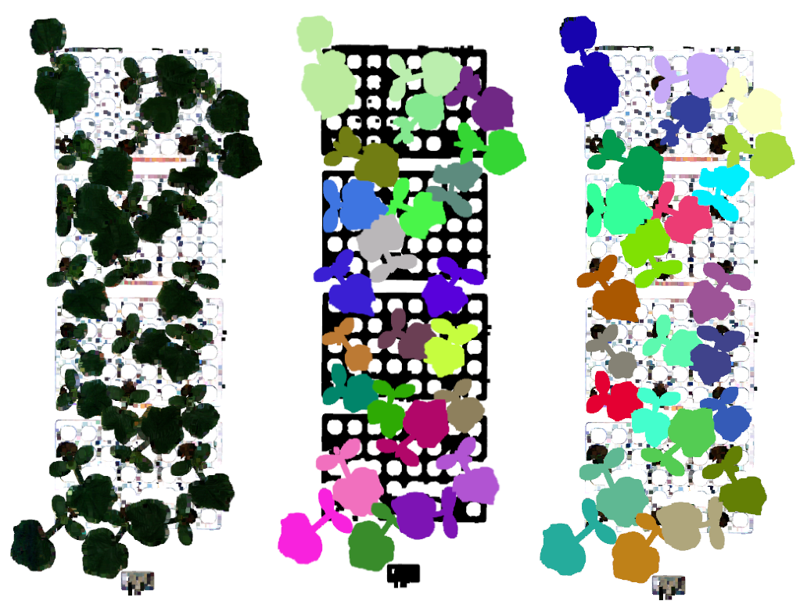

# Pointclouds Annotation and Instance Segmentation 
End to End pipeline for Annotation and Instance Segmentation of point clouds

## Motivation
In this work we will build End to End Pipeline for 3D pointclouds instance segmentation of plants for plant phenotyping. Plant seperation/Instance segmentation is the first step for high throughput phenotyping of plants. Traditional phenotyping requires plants to be removed/seperated mannually and then perform phenotyping. This process limits the speed of phenotyping and we can perform much faster phenotyping if we can seperate the plants using software. Fortunately, with recent advancements in deep learning based instance segmentation [1,3] we can perform 3D instance segmentation with high accuracy which was not possible using traiditional menthods of instance semgmentation like DBSCAN or Graph based clustering.  Thre are two major tasks we will address in this work\
\
**1) Build a pipeline for obtaining 3D point cloud annotated dataset for instance segmentation:** \
    3D pooint clouds take much more time to be segmented and hence the cost of their annotation can be 10x compare to 2D images. As a result there are not so many                   publically available datasets for point cloud instance segmentation.

**2) Benchmark and compare state-of-the-art 3D point clouds instance segmentation networks:** \
    Point clouds provide interesting challenge for instance segmentation becuase of their unstuctured, sparse and permuation invariant nauture. Unlike images there are not           enough  point clouds dataset publically available from different domains. Most of the point cloud datasets are from autonomous driving dmian and some from indoor point           clouds domain (containing furniture walls e.tc) for instance segmentation. It is not clear how deep neural networks trained and benchmarked on these datasets will perform on     out of domain datasets. 


### Stucture

    .
    ├── annotation              # 3D point cloud annotation using sagemaker 
    ├── algorithms              # Algorithms for 3D instance segmentation               
    ├── Sagemaker               # Train and deploy models in Sagemaker
    ├── Utils                   # General useful scripts                         
    └── ...

See the correspoding direcory for more detail for each.

### Requirements

pytohn>=3.7\
open3d\
In addition please see requirements of each algorithm to see the requiremnt of each algorithm.

## Point Cloud Annotation:
See annotation directory for details on Amazon sagemaker pipeline for 3D point cloud annotation. 

# Local Training and Evaluation
## Dataset prepration
* Run **write_dyco3d_input.py** (requires open3d package) with appropriate input paths of ply input point clouds and .zlib annotation file generated from Sagemaker point cloud labelling.
Output will be preprocessed ply files with labels written in text file in form (Nx1) where N are the number of point clouds in downsampled ply file.
Change this preprocessing step according to your needs (specify custom voxel size, scaling, height based filtering e.tc)
* Run **dataset/planteye/prepare_data_inst_planteye.py** to generate combine labels and ply in unifrm .pth format for training DyCo3D

### Instance Segmentation
* Based on https://github.com/aim-uofa/DyCo3D DyCo3D DyCo3d: Robust Instance Segmentation of 3D Point Clouds through Dynamic Convolution (CVPR 2021)
  and https://github.com/dvlab-research/PointGroup PointGroup: Dual-Set Point Grouping for 3D Instance Segmentation (CVPR2020)
* Modify config in **config/dycodyco3d_planteye.yaml** to desired dataset, iterations, learning rate, model checkpoint iterations, Evaluation epochs e.t.c
* Run train.py to run the training
* Use the checkpoint created by training and use in test.py  to test the dataset
* (Optional) Run **find_best_test_params.py** to perform grid search on best minimum number of points, score threshold and nms threshold to give the best mAP
* Visualize the results running  **visualize_dyco3d_out.py** (requires open3d package) by providing approriate paths of the mask generated by test step.
* Example Input Point cloud, Labels and Prediction is shown below

  <p align="center">
    
  </p>
   <p align="center">


# Sagemaker Training and Hyperparameter Tuning
* Use Dockerfile to build Dyco3D image and push to ECR for training the model in Sagemaker 
  
  
## References
```
1) @article{jiang2020pointgroup,
  title={PointGroup: Dual-Set Point Grouping for 3D Instance Segmentation},
  author={Jiang, Li and Zhao, Hengshuang and Shi, Shaoshuai and Liu, Shu and Fu, Chi-Wing and Jia, Jiaya},
  journal={Proceedings of the IEEE Conference on Computer Vision and Pattern Recognition (CVPR)},
  year={2020}}
2) @inproceedings{He2021dyco3d,
  title     =   {{DyCo3d}: Robust Instance Segmentation of 3D Point Clouds through Dynamic Convolution},
  author    =   {Tong He and Chunhua Shen and Anton van den Hengel},
  booktitle =   {Proceedings of the IEEE Conference on Computer Vision and Pattern Recognition (CVPR)},
  year      =   {2021}
}
3) @inproceedings{liang2021instance,
  title={Instance Segmentation in 3D Scenes using Semantic Superpoint Tree Networks},
  author={Liang, Zhihao and Li, Zhihao and Xu, Songcen and Tan, Mingkui and Jia, Kui},
  booktitle={Proceedings of the IEEE/CVF International Conference on Computer Vision},
  pages={2783--2792},
  year={2021}
}
  


