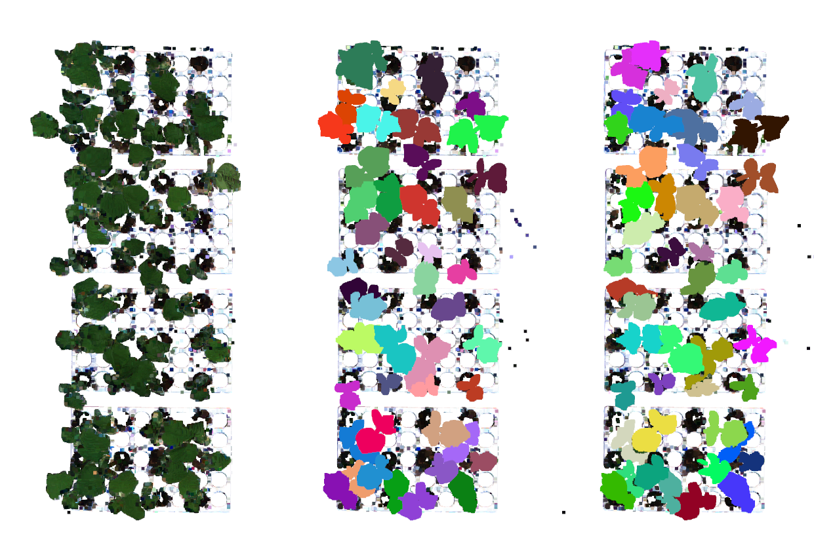
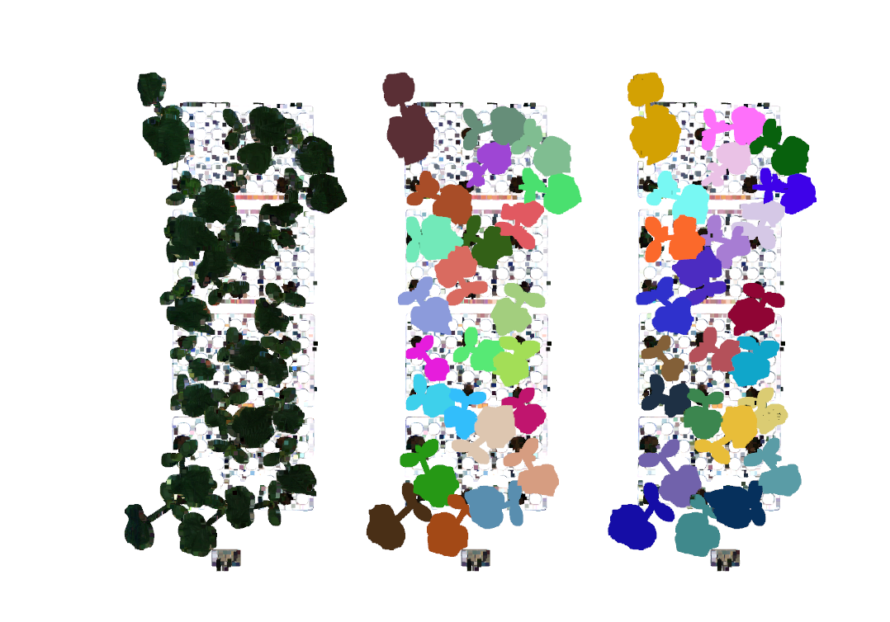
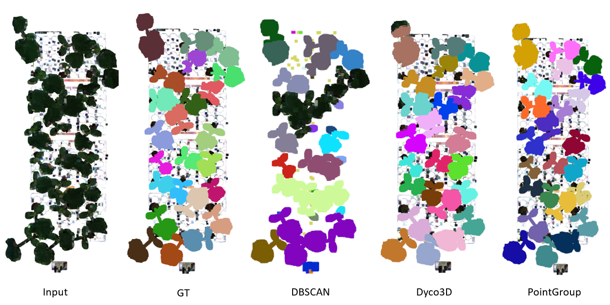
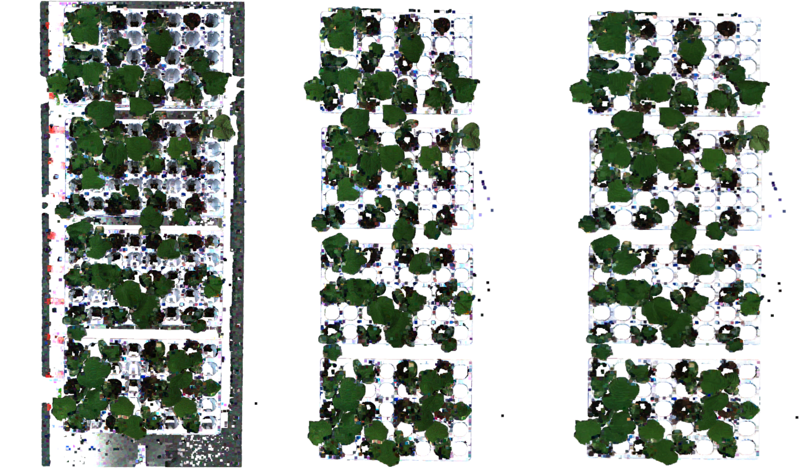

## [](https://github.com/Asad-Ismail/Pointclouds-Instance-Segmentation/issues)[](https://hits.seeyoufarm.com)

# Pointclouds Annotation and Instance Segmentation 
Instance Segmentation of point clouds on custom dataset for plant seperation

# Results

   Visual Results of PointGroup on some validation images. Left shows input point cloud, middle is GT and right are predictions
   
  <p align="center">
    
  </p>
   <p align="center"> 
    
   <p align="center">
    
  </p>
   <p align="center"> 
   
   <p align="center">
    
  </p>
   <p align="center"> 

  
<div align="center">

Algorithm | TrainCount | valCount | mAP @0.5:0.95
| :--- | ---: | ---: | :---:
DBSCAN | --   | 20 | 0.351
DyCO3D | 212 | 20 |  0.937
PointGroup | 212  | 20 |  0.986

</div>

<p align="center">
    
  </p>
<p align="center"> 
   


## Inference

  After clonig the directory should look like this
   
### Stucture

    .
    ├── annotation              # 3D point cloud annotation using sagemaker 
    ├── algorithms              # Algorithms for 3D instance segmentation               
    ├── dataset                 # Dataset for training  and validation
    ├── utils                   # General useful scripts for viusualization and pre/post processing point clouds                     
    └── ...

### Running PointGroup
   * Install requireemnts to run PointGroup as given here https://github.com/dvlab-research/PointGroup
   * ``` cd algorithms/PointGroup/Pointgroup/ ```
   * The dataset is supposed to reside in algorithms/PointGroup/Pointgroup/dataset/planteye/val you can change it in config/pointgroup_default_planteye.yaml
   * Download the pretrained models and example train and test data form https://shorturl.at/lLP29
   * ``` python test.py --resume planteye_trained_pointgroup.pth ```
   * Results are saved in Output_dir/results which can be modified via config
   * ``` python visualize_pointgroup_out.py ``` (requires open3D) by giving appropriate path of results from previous step

### Running DyCO3D
   * Install requireemnts to run PointGroup as given here https://github.com/dvlab-research/PointGroup
   * ``` cd algorithms/DYCO3D/DyCo3D/ ```
   * The dataset is supposed to reside in algorithms/DYCO3D/DyCo3D/dataset/planteye/val you can change it in config/dyco3d_besthp_planteye.yaml
   * Download the pretrained models and example train and test data form https://shorturl.at/lLP29
   * ``` python test.py --resume planteye_trained_dyco3d.pth ```
   * Results are saved in Output_dir/results which can be modified via config
   * ``` python visualize_dyco3d_out.py ``` (requires open3D) by giving appropriate path of results from previous step

   
## Training
   To train locally or on Sagemaker and to perform hyper parameter tuning see particular algorithm 
   
## Motivation
In this work we will explore 3D pointclouds instance segmentation of plants for plant phenotyping. Plant seperation/Instance segmentation is the first step for high throughput phenotyping of plants. Traditional phenotyping requires plants to be removed/seperated manually and then perform phenotyping. This process limits the speed of phenotyping and we can accelrate phenotyping if we can seperate the plants using software. Fortunately, with recent advancements in deep learning based instance segmentation [1,3] we can perform 3D instance segmentation with high accuracy which was not possible using traiditional methods of instance semgmentation like DBSCAN or traditional graph based clustering.  Thre are two major tasks we will address in this work\
\
**1) Build a pipeline for obtaining 3D point cloud annotated dataset for instance segmentation:** \
    3D point clouds take much more time to be segmented and hence the cost of their annotation can be 10x compare to 2D images. As a result there are not many publically available datasets for point clouds like Scannet for instance segmentation. Most of the point cloud datasets are from autonomous driving domian and some from indoor point clouds domain. It is not clear how deep neural networks trained and benchmarked on these datasets will perform on out of domain datasets. In this work we annotate 220 scans by building Sagmekaer 3D point cloud annotation pipeline.

**2) Benchmark point clouds instance segmentation networks:** \
    Point clouds provide interesting challenge for instance segmentation becuase of their unstuctured, unordered and sparse nature which requires special properties from neural networks like permuation invariance, transformation invariance and point interactions. We benchamrk and evaluate different state of the art algortihhms on our point cloud dataset.

## Pipeline Summary
## Preprocess Input Point Clouds
1) First the point clouds are preprocessed to downsamaple from millions of point clouds to few hundered thousands. We use voxel size of 3 cm to downsample the pointclouds 
2) Below we have an example, on left we have original point clouds with 7.4 million points on right we have preprocessed point clouds with removed tray (based on height threshold) and downsampled point clouds resulting in 3.4 and finally 1.3 million points 

  <p align="center">
    
  </p>
   <p align="center"> 
    
2) Train the deep neural network(PointGroup, Dyco3D) and perform hyper parameter search (Bayseian based) with the preprocessed data 
    
3) Use the trained network to make inference on new data.


See the correspoding direcory for more detail for each.

### Requirements

python>=3.7\
open3d\
In addition please see requirements of each algorithm to see the requiremnt of each algorithm.

    
### Point Cloud Annotation:
See annotation directory for details on Amazon sagemaker pipeline for 3D point cloud annotation. 


  
### References
```
1) @article{jiang2020pointgroup,
  title={PointGroup: Dual-Set Point Grouping for 3D Instance Segmentation},
  author={Jiang, Li and Zhao, Hengshuang and Shi, Shaoshuai and Liu, Shu and Fu, Chi-Wing and Jia, Jiaya},
  journal={Proceedings of the IEEE Conference on Computer Vision and Pattern Recognition (CVPR)},
  year={2020}}
2) @inproceedings{He2021dyco3d,
  title     =   {{DyCo3d}: Robust Instance Segmentation of 3D Point Clouds through Dynamic Convolution},
  author    =   {Tong He and Chunhua Shen and Anton van den Hengel},
  booktitle =   {Proceedings of the IEEE Conference on Computer Vision and Pattern Recognition (CVPR)},
  year      =   {2021}
}
3) @inproceedings{liang2021instance,
  title={Instance Segmentation in 3D Scenes using Semantic Superpoint Tree Networks},
  author={Liang, Zhihao and Li, Zhihao and Xu, Songcen and Tan, Mingkui and Jia, Kui},
  booktitle={Proceedings of the IEEE/CVF International Conference on Computer Vision},
  pages={2783--2792},
  year={2021}
}
  


